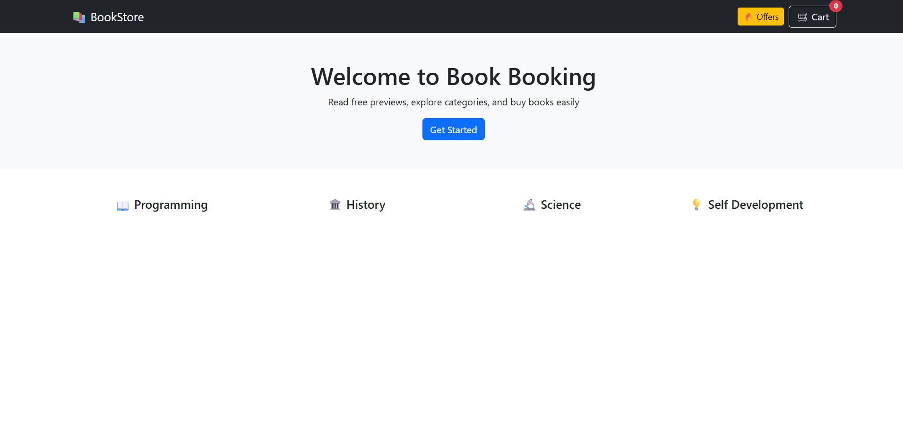
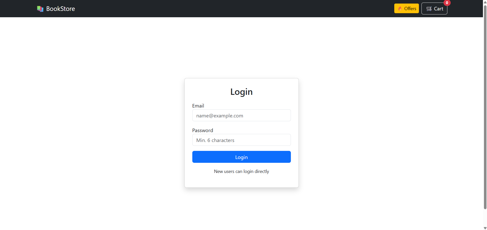
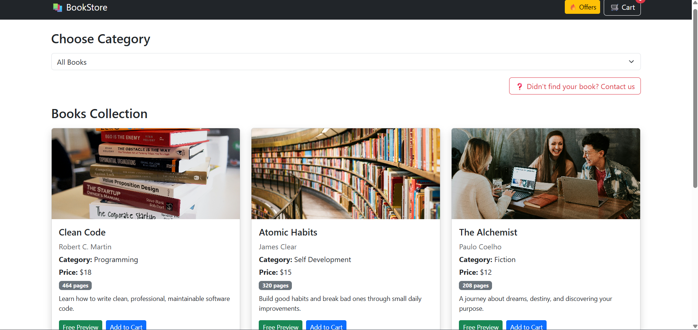
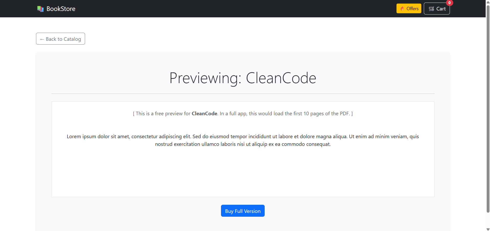
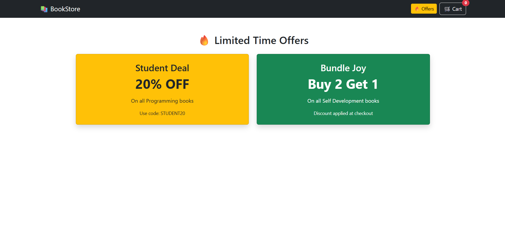
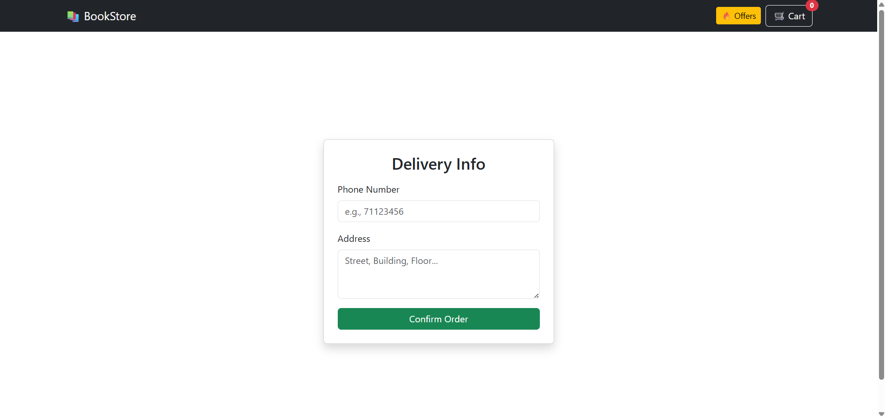
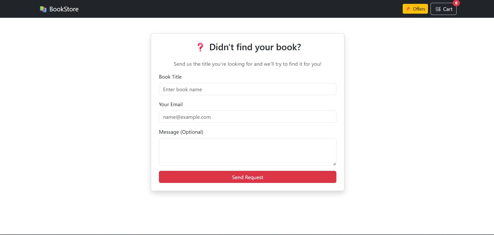

# 📚 Bookstore Project - Phase 2

## Project Description
A fully responsive React application for browsing and purchasing books. Users can filter books by category, view details in a preview mode, and add items to a dynamic shopping cart.

**Developed by:** Fadel Baghdadi & Ahmad Kondakji

## Setup Instructions
1. Clone this repository to your local machine.
2. Open the terminal in the project folder.
3. Run `npm install` to install dependencies.
4. Run `npm install react-router-dom bootstrap` (if not already installed).
5. Run `npm start` to launch the application.

## Technologies Used
* **React.js** for the frontend framework.
* **Bootstrap 5.3** for responsive UI design.
* **React Router** for page navigation.

## Screenshots
### 1. Home Page

### 2. Login Page

### 3. Main Page

### 4. Read Page

### 5. Offers Page

### 6. Buy Page

### 7. Contact Page

